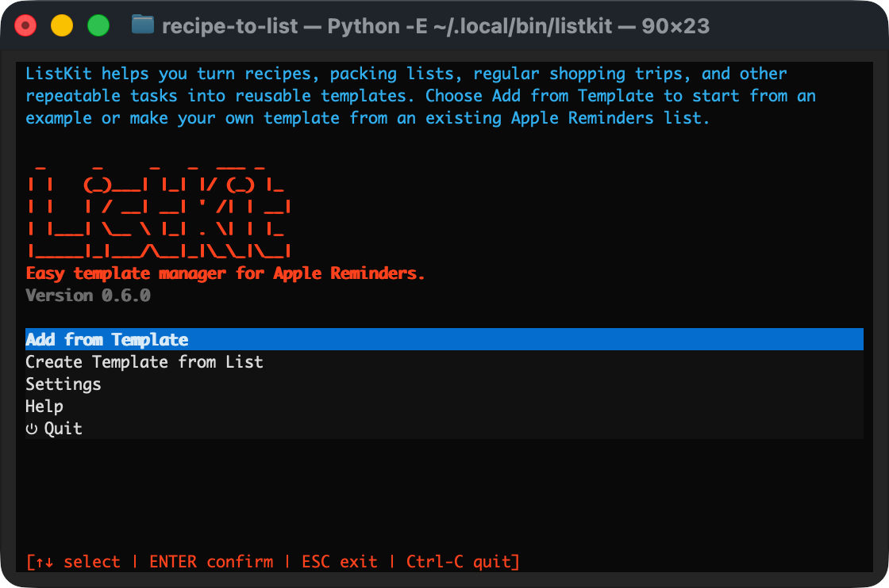
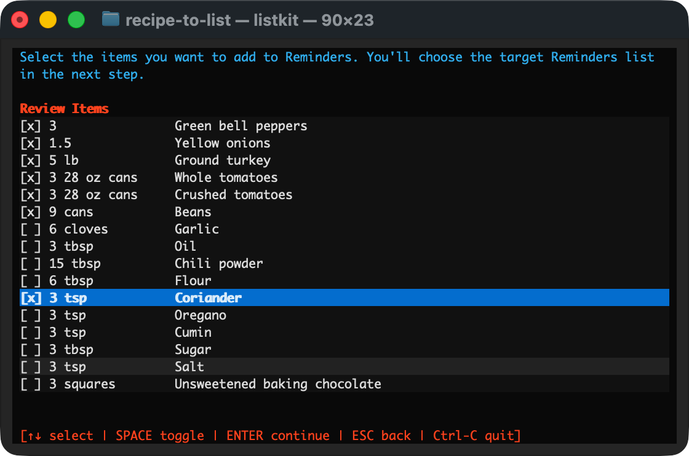
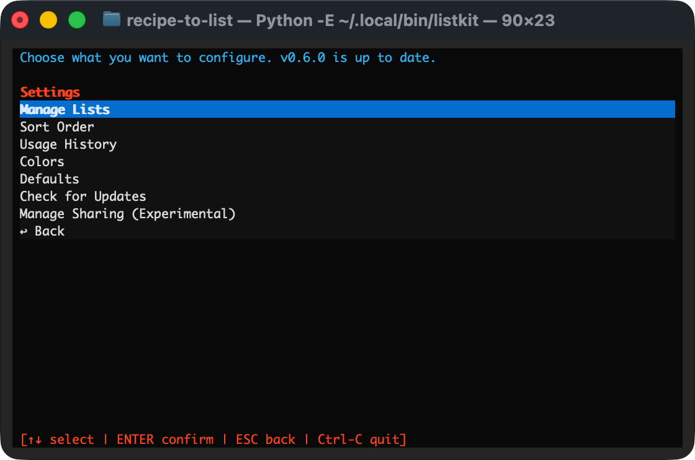
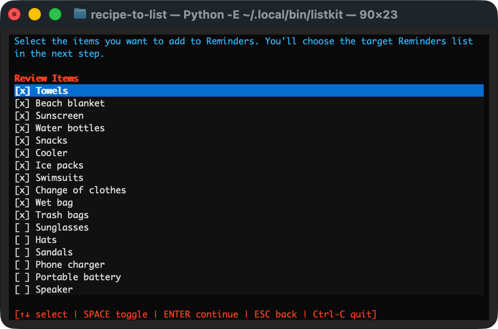

# ListKit: Easy Templates for Apple Reminders

> Alpha software: this project is actively changing and should be used at your
> own risk while it is in development. It can create real Apple Reminders items,
> so consider testing with a throwaway Reminders list first.

ListKit is a local command-line tool for creating Apple
Reminders lists from reusable JSON templates. It can handle recipe ingredient
lists, packing checklists, recurring store purchases, chores, trip prep, or
project checklists.

## Screenshots









## Install

ListKit requires macOS and [Homebrew](https://brew.sh).

### 1. Install pipx

```sh
brew install pipx
```

### 2. Install ListKit

```sh
pipx install git+https://github.com/baconandgames/listkit.git
```

### 3. Add pipx applications to your PATH

```sh
pipx ensurepath
```

If `pipx ensurepath` reports that it changed your PATH, **close and reopen
Terminal before continuing**. This is required before the `listkit` command is
available in a new shell session.

Zsh users can reload the current Terminal session instead:

```sh
exec zsh -l
```

Verify the installation:

```sh
listkit --version
```

Launch ListKit:

```sh
listkit
```

## First Run

ListKit works with its default settings, so opening Settings first is optional.

To review or change defaults:

```sh
listkit settings
```

The first time ListKit accesses Apple Reminders, macOS may ask you to grant
Reminders permission. Approve the request to create lists and reminders.

## Update

Update ListKit from Terminal with:

```sh
pipx upgrade listkit
listkit --version
```

If you installed an older pre-0.6 version under the previous package name,
reinstall once so future upgrades use the aligned ListKit package name:

```sh
pipx uninstall easy-reminder-templates
pipx install git+https://github.com/baconandgames/listkit.git
listkit --version
```

The update checker uses GitHub Releases. If a newer release exists, `listkit`
shows its changelog and can install the update from inside Settings. After a
successful update, ListKit prompts you to quit and relaunch so the new version is
active.

You can also check for updates from Settings:

```sh
listkit settings
```

For testing changes that have been pushed to `main` but not included in a
GitHub Release yet, reinstall from the branch explicitly:

```sh
pipx install --force git+https://github.com/baconandgames/listkit.git@main
listkit --version
```

## Installation Troubleshooting

### `listkit: command not found`

First, confirm that ListKit was installed:

```sh
pipx list
~/.local/bin/listkit --version
```

If the direct `~/.local/bin/listkit` command works, ListKit is installed but the
pipx application directory is not on your PATH. Run:

```sh
pipx ensurepath
```

Then close and reopen Terminal, or reload Zsh with:

```sh
exec zsh -l
```

Try again:

```sh
listkit --version
```

### Python installation fails on an older Mac

On some older Macs, Homebrew may be unable to install its default Python version
from a prebuilt package and may attempt a slow source build. Install Python 3.11
explicitly and use it for ListKit:

```sh
brew install python@3.11
pipx install \
  --python "$(brew --prefix python@3.11)/bin/python3.11" \
  git+https://github.com/baconandgames/listkit.git
```

Using `brew --prefix` makes this command work with both Intel and Apple silicon
Homebrew installations.

## Local Development

For local development, install in editable mode:

```sh
python3 -m venv .venv
.venv/bin/python -m pip install -e .
```

## Usage

Run with an optional template short name:

```sh
listkit
listkit chili
```

When no short name is provided, `listkit` opens the main menu. Choose **Add from
Template** to select a saved template, **Create Template from List** to turn an
existing Reminders list into a template, or **Settings** to adjust defaults,
colors, visible Reminders lists, template sharing, and updates.

You can also jump directly into a template with its short name, such as
`listkit chili`. If the short name is not found, `listkit` falls back to the
template picker so you can choose a template or return to the main menu.

Short names are meant for templates you run often. For example, `listkit chili`
is useful for a regular recipe, while a one-off travel checklist may be easier
to choose from the template picker. If the same short name exists in both local
and shared templates, ListKit asks which one you want instead of guessing.

When installed outside this repository, `listkit` creates user files in:

```text
~/Library/Application Support/ListKit/
```

That folder contains `config.json` and a `templates/` folder.

The CLI then prompts for:

- batch size, when the template includes quantities
- whether to include items marked as usually on hand, when relevant

Interactive screens can be exited with `Esc`. Pressing `Esc` backs out of
submenus and exits when you reach the top level. Most picker screens also show a
visible **↩ Back** row.

Before sending anything to Apple Reminders, `listkit` shows all template items in a
checkbox list. Items are preselected based on the on-hand prompt, and can be
added or removed before the selected items are sent to Reminders. The final
screen summarizes what was added.

## Templates

Templates live as individual JSON files under `templates/`.

```text
templates/
  classic-chili.json
  beach-day.json
  trader-joes-common-purchases.json
```

Subfolders are allowed for organization, but template IDs come from filenames,
not folders. Duplicate filenames and duplicate non-empty short names are not
allowed.

See [TEMPLATES.md](TEMPLATES.md) for the full JSON template guide, including
examples, field descriptions, blank-value behavior, and how to create a template
from an existing Apple Reminders list.

From **Help**, choose **Open Templates Folder** to open the template folder in
Finder. Templates are plain JSON files, so unwanted templates can be removed by
deleting their files.

See [CONTRIBUTING.md](CONTRIBUTING.md) for the current alpha contribution
policy.

Bundled examples show three common use cases:

- `Classic Chili` (`listkit chili`): a recipe with batch scaling and optional
  on-hand ingredients.
- `Beach Day` (`listkit beach`): a reusable packing checklist.
- `Trader Joe's Common Purchases` (`listkit tjs`): a store-specific staples list
  where usually-bought items start selected and occasional purchases are marked
  as on-hand.

## Shared Template Folders

Template sharing is experimental. Use **Settings** > **Manage Sharing
(Experimental)** to connect one shared folder from iCloud Drive, Dropbox, Google
Drive, or another folder on this Mac.

Shared folders are useful when more than one person should be able to use the
same templates. For example, a family might share recipes, packing lists, pet
care checklists, or recurring household shopping lists. Keep personal templates
local when they are only useful to you, contain private information, or are
still being drafted.

Shared templates appear in the picker with `(shared)` after the name:

```text
Beach Day
Beach Day (shared)
```

When creating a template from an Apple Reminders list, ListKit asks whether to
save it locally or in the shared folder if sharing is configured. Choose local
for private or unfinished templates. Choose shared when the template is ready
for everyone using that folder. Shared templates are saved directly in the
folder you selected, so reconnect to that same folder later.

Use a dedicated shared folder with valid ListKit template JSON files. Non-JSON
files are ignored. Invalid shared JSON files are skipped with a warning so the
rest of your templates can still load. If the shared folder is moved, renamed,
or unavailable, local templates still work.

From **Help**, choose **Open Shared Templates Folder** to inspect the shared
folder in Finder when sharing is configured.

## Configuration

Terminal display options live in `config.json` and can be edited directly in a
text editor.

```json
{
  "apple_reminders_list_id": "",
  "apple_reminders_list_name": "Groceries",
  "hidden_apple_reminders_list_ids": [],
  "append_short_name": true,
  "include_on_hand_default": false,
  "standard_text_color": "#f2f0ea",
  "quantity_color": "#37b7f0",
  "selection_color": "#ff4b1f",
  "omitted_ingredient_color": "#777777",
  "skipped_update_version": "",
  "template_sort_order": "name_asc",
  "reminders_list_sort_order": "name_asc",
  "template_usage_counts": {},
  "reminders_list_usage_counts": {},
  "external_templates_path": ""
}
```

Supported color values:

- Hex colors in `#rrggbb` format, when supported by your terminal.
- `black`
- `red`
- `green`
- `yellow`
- `blue`
- `magenta`
- `cyan`
- `white`
- `grey`

Invalid color values fall back to the default for that setting.

Apple Reminders lists can be targeted by `apple_reminders_list_name`, including
lists inside Reminders folders. `listkit` prompts you to choose from available
lists, starts on the configured list name, and shows a few existing items only
when multiple lists share the same name.

At the reminder-list prompt, choose `[ + Create New List]` to create a new Apple
Reminders list before adding the selected template items.

When `apple_reminders_list_id` is set, it is preferred over
`apple_reminders_list_name`.

Run `listkit settings` to open Settings; `listkit config` is also supported.
From there, choose which Apple Reminders lists appear as destinations, edit
terminal colors, update common defaults, manage experimental template sharing,
and check for GitHub release updates. Hidden lists are stored in
`hidden_apple_reminders_list_ids`.

Template sharing is stored in `external_templates_path`. A blank value means no
shared folder is configured.
